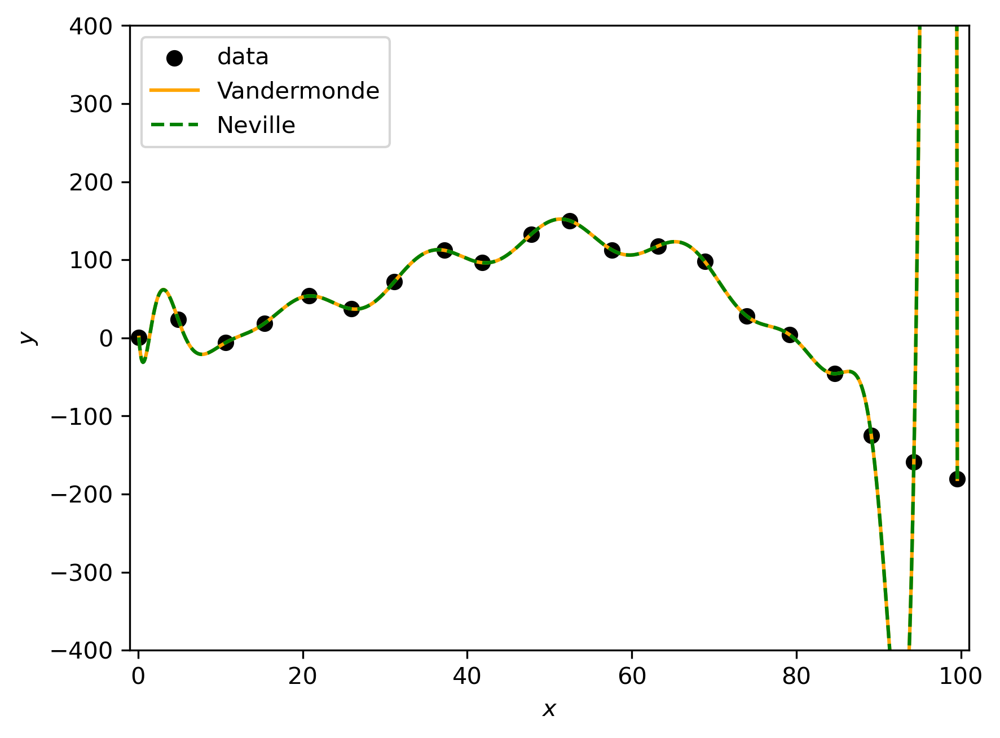
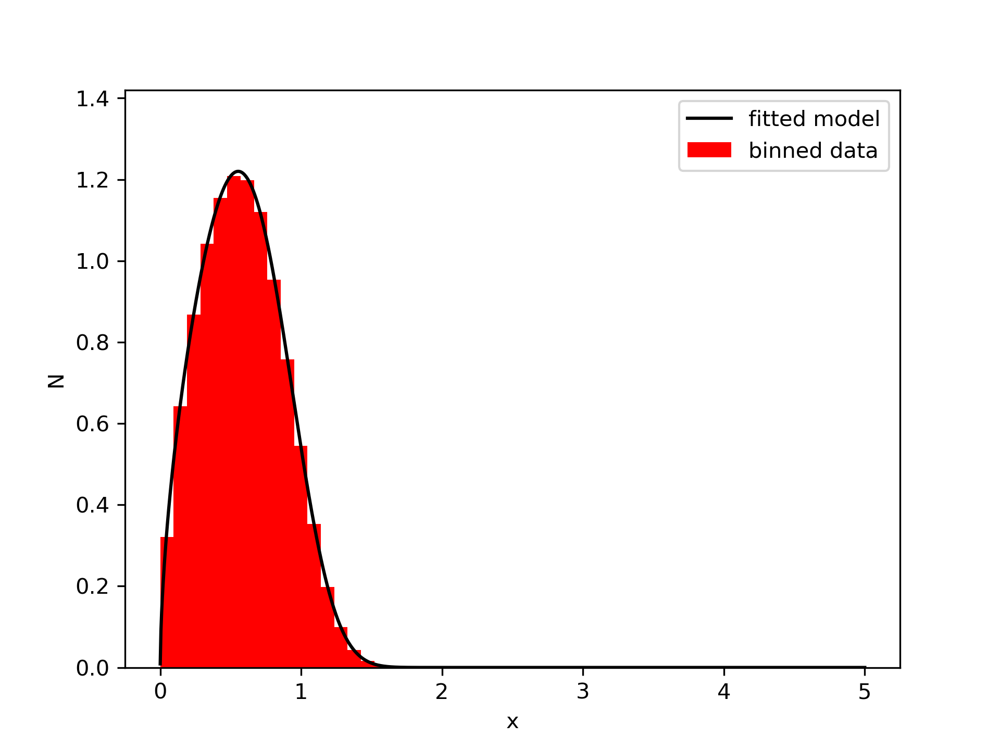

# Numerical Recipes in Python


*Animation of the Selection Sort algorithm. The algorithm sorts the array by selecting the minimum element and swapping it with the first element of the unsorted part of the array. For more details and algorithms, keep reading.*

## Introduction

Code for the exercises from the course "Numerical Recipes" at Leiden University. The exercises are divided into four sets, each with a different focus. The first set is about polynomial interpolation and numerical differentiation. The second set is about numerical integration and root finding. The third set is about minimization and statistical tests. The fourth set is about integration of ordinary differential equations (ODEs), Fast Fourier Transform (FFT), and classification using Logistic Regression.

The goal of the exercises is to implement numerical methods from scratch and to understand how they work. All the different methods implemented are already available in Python packages like `numpy`, `scipy`, and `scikit-learn`. However, the goal is to understand the algorithms behind the methods and to be able to implement them ourselves.

## Files

The repository contains files from four different sets of exercises. Each set has a corresponding shell script that runs the Python scripts and saves the output to the appropriate files. The shell scripts are:
- `set1.sh`: Runs the Python scripts for set 1.
- `set2.sh`: Runs the Python scripts for set 2.
- `set3.sh`: Runs the Python scripts for set 3.
- `set4.sh`: Runs the Python scripts for set 4.

When running the shell scripts, it will also create a pdf file with the report of the results. The pdf files are:
- `report_1.pdf`: Report for set 1.
- `report_2.pdf`: Report for set 2.
- `report_3.pdf`: Report for set 3.
- `report_4.pdf`: Report for set 4.

For the creation of the pdf files, the shell scripts use the TeX code in the `TeX/` directory. 

Each set of exercises runs different Python scripts. All the scripts are in the root directory of the repository.

For set 1, the files are:
- `poisson.py`: Python script to calculate the poisson probability using only 32-bit integers.
- `lu_decomp.py`: Polynomial interpolation using LU decomposition.
- `neville.py`: Polynomial interpolation using Neville's algorithm.
- `iteration_lu.py`: Iterative improvement of the LU decomposition method for polynomial interpolation.
- `time_1.py`: Timing the different methods for polynomial interpolation.

For set 2, the files are:
- `open_int.py`: Open integration using the Romberg and Trapezoid methods.
- `distr.py`: Random number generation using the Linear Congruential Generator (LCG) and Random Sampling to create a distribution.
- `sort.py`: Sorting using the Selection Sort and randomizing the array using the Fisher-Yates algorithm.
- `deriv.py`: Numerical differentiation using the Central Difference and Ridder's method.
- `root1.py`: Root finding using the False Position and Newton-Raphson methods.
- `root2.py`: Root finding using the Secant method.
- `time_2.py`: Timing the different methods for root finding.

For set 3, the files are:
- `minimize.py`: Minimization using the Golden Search and Bracket Minimum methods.
- `chisquare.py`: Chi-square minimization to fit a distribution.
- `likelihood.py`: Fitting a distribution using the Poisson log-likelihood.
- `stat_test.py`: Statistical tests using the Chi-square Goodness of Fit and Kolmogorov-Smirnov tests.

For set 4, the files are:
- `initial.py`: Get the initial positions of the planets using the `astropy` package.
- `leapfrog.py`: Leapfrog integration to calculate the orbits of the planets.
- `euler.py`: Euler integration to calculate the orbits of the planets.
- `generate.py`: Generate a grid with the densities of some particles.
- `fft.py`: Fast Fourier Transform (FFT) using the Cooley-Tukey algorithm to calculate the power spectrum of the grid. Then caclulates the potential grid by solving Poisson's equation in Fourier space and using the inverse FFT to get the potential in real space.
- `prepare.py`: Prepare the data for a classification problem.
- `classification.py`: Classify the data using Logistic Regression with a Sigmoid function, a custom Loss function, and the Broyden-Fletcher-Goldfarb-Shanno (BFGS) optimization method (which uses the Golden Search method we implemented in set 3).
- `evaluation.py`: Evaluate the classification by measuring the accuracy, the true/false positive/negative rates, and the F1 score. We also plot each combination of features to see how well they separate the classes.


The repository also contains the following files and directories:
- `sort_animation.py`: Python script to create an animation of the Selection Sort algorithm.
- `TeX/`: Directory with the TeX code for the reports.
- `data/`: Directory with the data files used in the exercises.
- `output/`: Directory with the output files generated by the shell scripts.
- `plots/`: Directory with the plots generated by the Python scripts.
- `requirements.txt`: File with the Python packages required to run the scripts.
- `README.md`: This file.

## Requirements

The code was written in Python 3.9.16, but it should work with any version of Python 3. The required Python packages are limited and are probably already installed in your system. If not, you can install them using the following command:

```bash
pip install -r requirements.txt
```

## How to run the code

The best way to run the code is to use the shell scripts. You can run the shell scripts using the following commands:

```bash
bash set1.sh
bash set2.sh
bash set3.sh
bash set4.sh
```

The shell scripts will run the Python scripts and save the output to the appropriate files. The output files will be saved in the `output/` directory. The plots will be saved in the `plots/` directory. The reports will be generated in the root directory using the TeX code in the `TeX/` directory.

If you want to run the Python scripts individually, you can use the following commands:

```bash
python <script_name>.py
```

For example:

```bash
python poisson.py
```

This will run the `poisson.py` script and print the output to the terminal. The problem with running the scripts individually is that they will not generate the text files with the output, which might be used in some scripts. However, since the outputs are already provided in the repository, there should be no problem in running the scripts individually. If you want to make sure that the outputs are generated, you can run the code like this:

```bash
python <script_name>.py > output/<script_name>.txt
```

This will save the output to the appropriate file in the `output/` directory.

## Results

The results of the exercises are presented in the reports, which include the source code, the output, and the plots generated by the Python scripts. The reports also explain the methods used and the results obtained. Some of the results are shown below.


*The Lagrange polynomial using the Vandermonde matrix and Neville's algorithm.*


*Sampling Galaxies from a distribution, with a Random Number Generator and the Rejection Sampling method.*


*Maximization using the Golden Search method.*


*Fitting a model to a distribution using the minimization of the Poisson log-likelihood.*


*Orbits of the planets using the Leapfrog integration method.*


*Orbits of the planets using the Euler integration method. We can see that the orbits are no longer stable.*


*Slice of the potential grid calculated in the Fourier space with the Poisson equation. To get the grid in Fourier space, we used the Fast Fourier Transform (FFT) with the Cooley-Tukey algorithm. The Inverse FFT was used to get the potential in real space.*


*Training the Logistic Regression model using the BFGS optimization method. The different lines show different combinations of features. The y-axis is the cost function, and the x-axis is the number of iterations.*


*Classification of the data using Logistic Regression. The different colors represent the different classes. The line is the decision boundary. The x-axis is the first feature, and the y-axis is the second feature.*